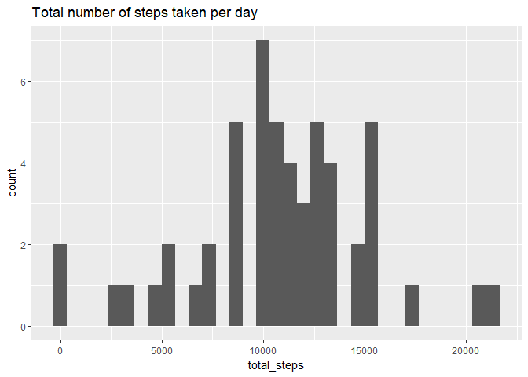
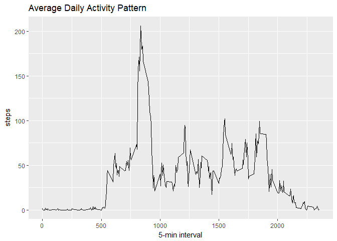
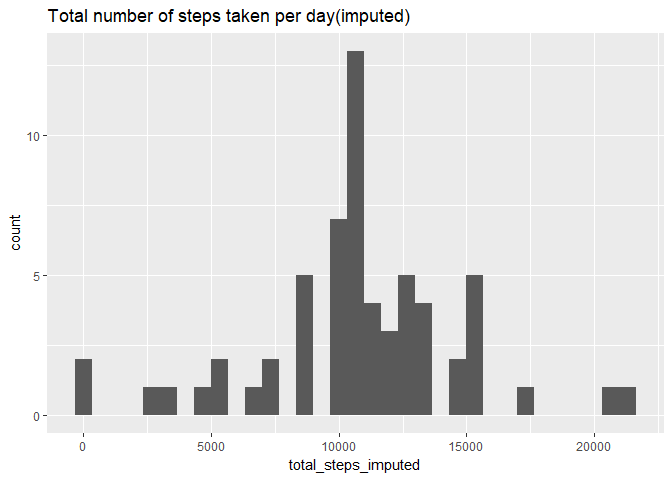
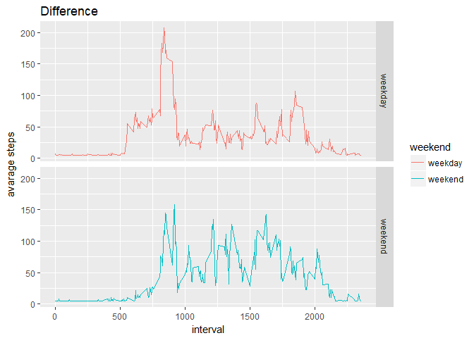

##Reproducible week2 

```r
library(dplyr)
```

```
## 
## Attaching package: 'dplyr'
```

```
## The following objects are masked from 'package:stats':
## 
##     filter, lag
```

```
## The following objects are masked from 'package:base':
## 
##     intersect, setdiff, setequal, union
```

```r
library(ggplot2)
library(scales)
library(Hmisc)
```

```
## Loading required package: lattice
```

```
## Loading required package: survival
```

```
## Loading required package: Formula
```

```
## 
## Attaching package: 'Hmisc'
```

```
## The following objects are masked from 'package:dplyr':
## 
##     src, summarize
```

```
## The following objects are masked from 'package:base':
## 
##     format.pval, units
```

##1.Loading and preprocessing the data

```r
activity <- read.csv("activity.csv")
head(activity)
```

```
##   steps       date interval
## 1    NA 2012-10-01        0
## 2    NA 2012-10-01        5
## 3    NA 2012-10-01       10
## 4    NA 2012-10-01       15
## 5    NA 2012-10-01       20
## 6    NA 2012-10-01       25
```

```r
str(activity)
```

```
## 'data.frame':	17568 obs. of  3 variables:
##  $ steps   : int  NA NA NA NA NA NA NA NA NA NA ...
##  $ date    : Factor w/ 61 levels "2012-10-01","2012-10-02",..: 1 1 1 1 1 1 1 1 1 1 ...
##  $ interval: int  0 5 10 15 20 25 30 35 40 45 ...
```

```r
summary(activity)
```

```
##      steps                date          interval     
##  Min.   :  0.00   2012-10-01:  288   Min.   :   0.0  
##  1st Qu.:  0.00   2012-10-02:  288   1st Qu.: 588.8  
##  Median :  0.00   2012-10-03:  288   Median :1177.5  
##  Mean   : 37.38   2012-10-04:  288   Mean   :1177.5  
##  3rd Qu.: 12.00   2012-10-05:  288   3rd Qu.:1766.2  
##  Max.   :806.00   2012-10-06:  288   Max.   :2355.0  
##  NA's   :2304     (Other)   :15840
```


##2.What is mean total number of steps taken per day?

```r
steps_day <- aggregate(activity$steps, by=list(activity$date), sum)

names(steps_day)[2] = "total_steps"
qplot(total_steps, data=steps_day, binwidth=666, main='Total number of steps taken per day')
```

```
## Warning: Removed 8 rows containing non-finite values (stat_bin).
```

<!-- -->

```r
summary(steps_day)
```

```
##        Group.1    total_steps   
##  2012-10-01: 1   Min.   :   41  
##  2012-10-02: 1   1st Qu.: 8841  
##  2012-10-03: 1   Median :10765  
##  2012-10-04: 1   Mean   :10766  
##  2012-10-05: 1   3rd Qu.:13294  
##  2012-10-06: 1   Max.   :21194  
##  (Other)   :55   NA's   :8
```
###mean is 10766, median is 10765


##3.What is the average daily activity pattern?

```r
steps_interval <- aggregate(steps ~ interval, activity, mean)
g <- ggplot(steps_interval, aes(x = interval, y=steps)) 
g <- g + geom_line()
g <- g + labs(title = "Average Daily Activity Pattern", x = "5-min interval", y = "steps")
g
```

<!-- -->

```r
maximum <- steps_interval[which.max(steps_interval$steps), ]
maximum
```

```
##     interval    steps
## 104      835 206.1698
```


##4.Imputing missing values

```r
missing_values <- sum(is.na(activity$steps))
missing_values
```

```
## [1] 2304
```

```r
imputed_data <- activity
imputed_data$steps <- impute(activity$steps, mean)

steps_day_imputed <- aggregate(imputed_data$steps, by=list(imputed_data$date),sum)

names(steps_day_imputed)[2] = "total_steps_imputed"
qplot(total_steps_imputed, data=steps_day_imputed, binwidth=666, main='Total number of steps taken per day(imputed)')
```

<!-- -->

```r
summary(steps_day_imputed)
```

```
##        Group.1   total_steps_imputed
##  2012-10-01: 1   Min.   :   41      
##  2012-10-02: 1   1st Qu.: 9819      
##  2012-10-03: 1   Median :10766      
##  2012-10-04: 1   Mean   :10766      
##  2012-10-05: 1   3rd Qu.:12811      
##  2012-10-06: 1   Max.   :21194      
##  (Other)   :55
```
###mean is 10766, median is 10766


##5.Are there differences in activity patterns between weekdays and weekends?


```r
#POSIXlt wday: 0¨C6 day of the week, starting on Sunday
wday <- as.POSIXlt(imputed_data$date)$wday

#ifelse(test, yes, no)
imputed_data$weekend <- ifelse(wday %in% c(0,6), "weekend", "weekday") 

average_imputed_data <- aggregate(steps~interval + weekend, data = imputed_data, mean)

g <- ggplot(average_imputed_data , aes(interval, steps)) 
g <- g + geom_line(aes(color=weekend))  
g <- g + facet_grid(weekend ~ .) 
g <- g + labs(title="Difference", x = "interval", y = "avarage steps")
g
```

<!-- -->

